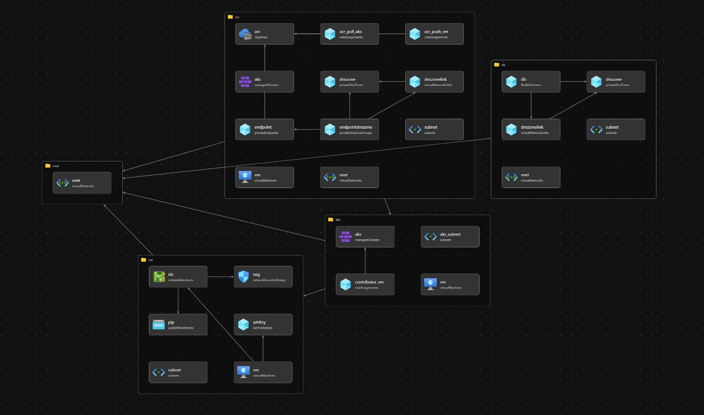

# Azure ポータルのカスタマイズフォームからARMテンプレートをデプロイするサンプル

## 構成

## URL
https://portal.azure.com/#create/Microsoft.Template/uri/https%3A%2F%2Fraw.githubusercontent.com%2Fussvgr%2Fmokumoku20220730%2Fmaster%2Fmain.json/uiFormDefinitionUri/https%3A%2F%2Fraw.githubusercontent.com%2Fussvgr%2Fmokumoku20220730%2Fmaster%2Fuiform.json